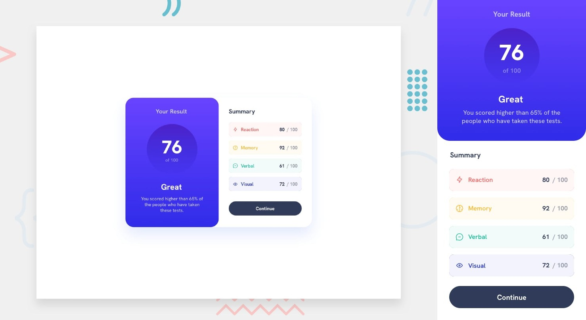

# Frontend Mentor - Results summary component solution

This is my solution to the [Results summary component challenge on Frontend Mentor](https://www.frontendmentor.io/challenges/results-summary-component-CE_K6s0maV)

## The challenge

Users should be able to:

- View the optimal layout for the interface depending on their device's screen size
- See hover and focus states for all interactive elements on the page

### Links

- Solution URL: [Add solution URL here](https://www.frontendmentor.io/challenges/results-summary-component-CE_K6s0maV)
- Live Site URL: [Add live site URL here](https://jhon-okayda-result-summary.netlify.app/)

### Built with

- HTML5
- Tailwind-CSS

## Author

- Created by - okayda-jhon
